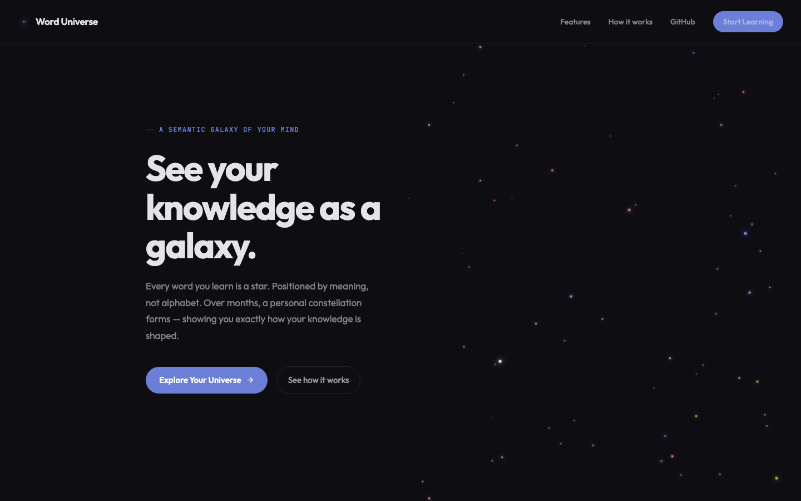
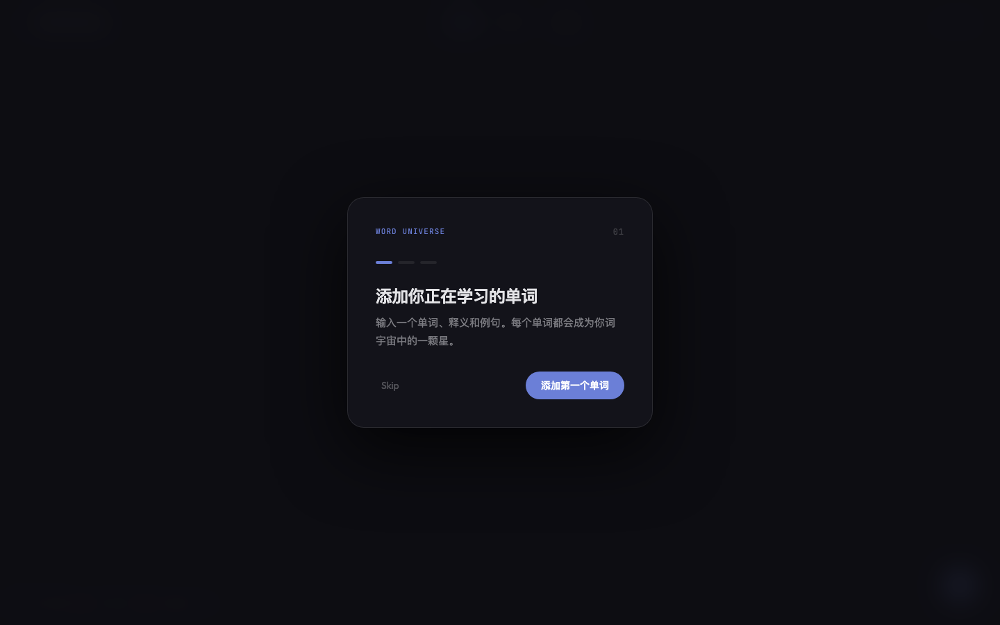
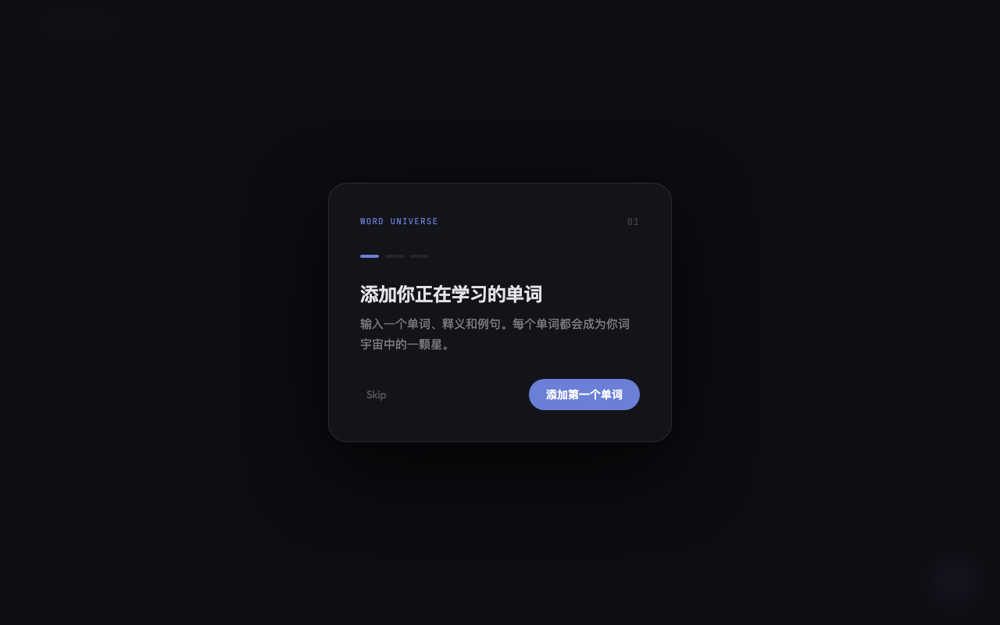
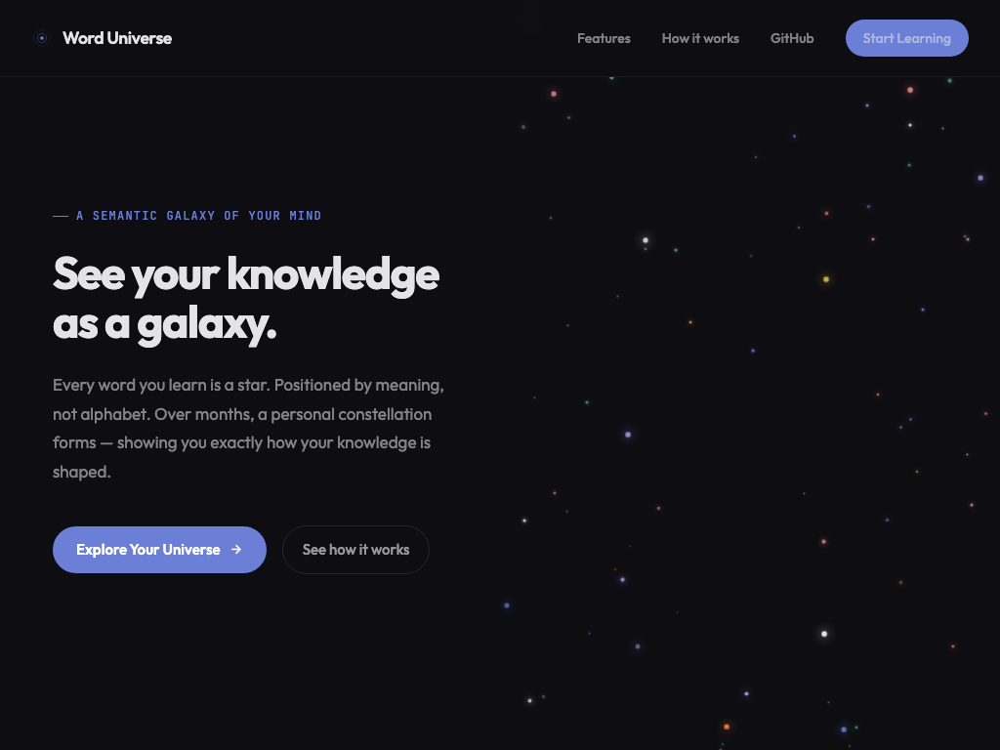

<div align="center">

[🇨🇳 简体中文](#-简体中文) | [🇺🇸 English](#-english-version)

</div>

---

# 🇨🇳 简体中文

# 🌌 单词宇宙 · Word Universe

> **把「枯燥的背单词」变成一片浩瀚的个人知识星空。**
> 你学习的每一个单词都是一颗独特恒星。它们不按冷冰冰的字母表排序，而是由大语言模型（LLM Embeddings）驱动，按“语义亲缘关系”自然聚类。日积月累，你的词汇量将汇聚成一套独一无二的个人星座谱系——直观看见你大脑中知识星系的形状。

**🕹️ 在线体验：[打开知识星空 →](https://zhuxinyao99-jpg.github.io/word-universe/app/)** &nbsp;|&nbsp; **[着陆页 (Landing Demo) →](https://zhuxinyao99-jpg.github.io/word-universe/)**

**🖥️📱 多端无缝适配，随时随地仰望星空：**

| 设备场景 | 交互体验 | 核心优势 |
|---|---|---|
| 💻 **桌面端 / 笔记本** | 完整 D3.js 物理力学力导向图 | 支持鼠标滚轮缩放、拖拽探索星座，丝滑流畅 |
| 📱 **移动端 / 手机** | 触屏手势交互优化 | 双指捏合缩放星空，随时添加今日新词，随时复盘 |
| 💬 **微信 / 社交内嵌** | 聊天框直接点击打开 | 无需跳出浏览器，轻量化加载，适合打卡分享 |
| 📲 **iPad / 平板** | 横竖屏自适应布局 | 大屏沉浸式漫游，视觉震撼感拉满 |

*说明：所有词汇数据完全保存在你浏览器的本地存储（LocalStorage）中，没有第三方跟踪，你的知识领空只属于你。*

---

## 📷 见证你的知识星系

*（以下为展示预留区，推荐放入你的精彩项目截图）*

| | |
|:---:|:---:|
|  **全景力导向星空图**：语义相近的单词自动互相吸引聚类 |  **自然分类**：具体物、抽象概念、动作、自然、社交自动识别 |
|  **掌握度进化**：0~3级打分，满级单词散发耀眼金色光芒 |  **极简输入**：支持接入 OpenAI/MiniMax 实时生成真实高维向量 |

---

## 为什么做这个项目？

- **传统按字母背单词太反人类**：`abandon` 永远背不完，词汇之间毫无关联，记了就忘；
- **记忆需要“空间位置感”**：大脑记忆不仅依赖重复，更依赖关联与空间结构。当你看到「动作」词汇聚集在左下角，而「抽象概念」在右上角形成星云时，记忆效率成倍提升；
- **成就感可视化**：传统的打卡只是一个数字，而在 Word Universe 里，你每多学一个词，你的宇宙里就点亮一颗新的恒星。

---

## 🌟 核心特性：它不是背词软件，是一座漫游宇宙

| 特性 | 说明 |
|---|---|
| 🧭 **语义物理定位** | 告别字母表！基于 LLM Embeddings 高维空间映射，含义相近的词自动在力导向图中相互靠近 |
| 🎨 **五大星系自动聚类** | 自动将词汇归入 **Concrete (具体物)**、**Abstract (抽象概念)**、**Action (动作)**、**Nature (自然)**、**Social (社交)** 五大色彩星云 |
| ⭐ **熟练度光度进化** | 0~3 级掌握度打分。0级是黯淡新星，3级则转化为璀璨的金色恒星，激励你持续复习 |
| 🚀 **D3.js 物理引擎** | 极具手感的拖拽与碰撞效果。支持自由拖拽星体、自由缩放视界，在词汇的海洋中沉浸漫游 |
| 🔒 **零后端纯本地私密** | 纯前端架构。数据 100% 存放在你自己的设备上，绝对私密，永不丢失，加载零延迟 |
| 🤖 **支持真实 AI 嵌入** | 内置确定性回退算法，同时支持配置 OpenAI / MiniMax API Key，解锁真正的千维语义空间计算 |

---

## 🧪 体验聚类魔法：试试这些新手词汇

添加以下词汇，亲眼见证星空如何自动牵引聚类：

| 单词 | 语言 | 归属星云 (自动识别) | 语境例句 |
|---|---|---|---|
| **ephemeral** | 英文 | 🟣 Abstract (抽象) | *"Fame in social media is often ephemeral."* |
| **serendipity** | 英文 | 🟣 Abstract (抽象) | *"Finding that book was pure serendipity."* |
| **mountains** | 英文 | 🟢 Nature (自然) | *"We spent a week in the mountains."* |
| **create** | 英文 | 🔴 Action (动作) | *"She wants to create something meaningful."* |
| **friend** | 英文 | 🟡 Social (社交) | *"He's been my best friend for ten years."* |

---

## 🚀 快速开始 / 本地运行

无需复杂的环境配置，纯前端项目开箱即用：

```bash
# 1. 克隆仓库
git clone https://github.com/nuts-and-bytes/word-universe.git
cd word-universe

# 2. 推荐使用任意静态服务器启动（或直接双击 index.html）
npx serve .
# 打开浏览器访问 http://localhost:3000/app/ 即可探索星空
```

### 💡 进阶：解锁真正 AI 语义向量 (Optional)
1. 获取一个 OpenAI 或 MiniMax API Key；
2. 打开网页后，按 `F12` 打开浏览器开发者工具 (Console)；
3. 输入并运行：`localStorage.setItem('openai_api_key', '你的API密钥')`；
4. 刷新页面，之后添加的所有新词将调用 AI 实时生成 1536 维语义向量！

---

## ⌨️ 快捷键

| 快捷键 | 功能 |
|---|---|
| `Ctrl + N` / `Cmd + N` | 快速唤起添加新词面板 |
| `Esc` | 关闭弹窗 / 退出当前查看 |

---

## 📜 许可与共建

本项目采用 **MIT 开源许可证**。欢迎提 Issue 和 Pull Request 一起扩展宇宙边界！

⭐ **如果这片独特的知识星空打动了你，请点个 Star 帮我们照亮更远的地方！**
*你的每一次点亮，都是这个宇宙持续膨胀的动力。*

---
---

# 🇺🇸 English Version

# 🌌 Word Universe

> **See your vocabulary as a living, breathing galaxy.**
> Every word you learn becomes a unique star. Instead of cold alphabetical lists, words are positioned by meaning using LLM Embeddings. Over time, your vocabulary forms a personal constellation — revealing the exact shape and structure of your knowledge.

**🕹️ Live Demo: [Explore the Galaxy →](https://zhuxinyao99-jpg.github.io/word-universe/app/)** &nbsp;|&nbsp; **[Landing Page →](https://zhuxinyao99-jpg.github.io/word-universe/)**

**🖥️📱 Cross-Platform Support — Explore Anywhere:**

| Device | How to Play | Experience |
|---|---|---|
| 💻 **Desktop / Laptop** | Open link in browser | Full D3.js force-directed graph with smooth zoom, pan, and drag interactions |
| 📱 **Mobile Phones** | Touch-optimized UI | Pinch to zoom, swipe across constellations, and add new words on the go |
| 💬 **WeChat / In-App** | Click link in chats | Lightweight loading without leaving your social apps |
| 📲 **Tablets / iPad** | Responsive landscape/portrait | Immersive widescreen exploration of your personal universe |

*Note: All data is stored 100% locally in your browser's LocalStorage. No trackers, no servers, complete privacy.*

---

## 📷 See Your Galaxy in Action

*（Recommended image placeholders for your repository screenshots）*

| | |
|:---:|:---:|
|  **Force-Directed Galaxy**: Words with related meanings gravitate towards each other naturally |  **Smart Clustering**: Concrete, Abstract, Action, Nature, and Social domains |
|  **Mastery Evolution**: Rate words 0–3. Level 3 stars glow with a brilliant golden aura |  **AI Embeddings**: Support for OpenAI / MiniMax API keys for true high-dimensional positioning |

---

## Why We Built This

- **Alphabetical lists are broken**: Memorizing `abandon` over and over lacks context and spatial memory;
- **Spatial cognition drives memory**: When you physically see action verbs grouping in one corner and abstract philosophies forming a nebula in another, retention multiplies;
- **Visualizing your progress**: Instead of a boring daily streak number, every learned word literally ignites a new star in your universe.

---

## 🌟 Core Features

| Feature | Description |
|---|---|
| 🧭 **Semantic Positioning** | Powered by LLM Embeddings. Related concepts naturally drift together and cluster in real-time |
| 🎨 **Five Cosmic Nebulae** | Automatically categorizes words into **Concrete**, **Abstract**, **Action**, **Nature**, and **Social** clusters |
| ⭐ **Mastery Luminosity** | Rate words from Level 0 (dim star) to Level 3 (radiant golden star) to track your review progress |
| 🚀 **D3.js Physics Engine** | Experience fluid physics. Drag stars, watch them bounce, and zoom through infinite vocabulary space |
| 🔒 **100% Private & Serverless** | Pure frontend architecture. Your data never leaves your device's LocalStorage. Zero latency |
| 🤖 **Real AI Embeddings Support** | Works offline with deterministic fallback, or plug in your OpenAI/MiniMax API key for real neural embeddings |

---

## 🚀 Quick Start

No database or complex backend required:

```bash
# 1. Clone repository
git clone https://github.com/nuts-and-bytes/word-universe.git
cd word-universe

# 2. Run with any local static server
npx serve .
# Open http://localhost:3000/app/ in your browser
```

---

## 📜 License

MIT License. Contributions, issues, and feature requests are always welcome!

⭐ **If this project inspires you, please give it a Star to help our universe expand!**
